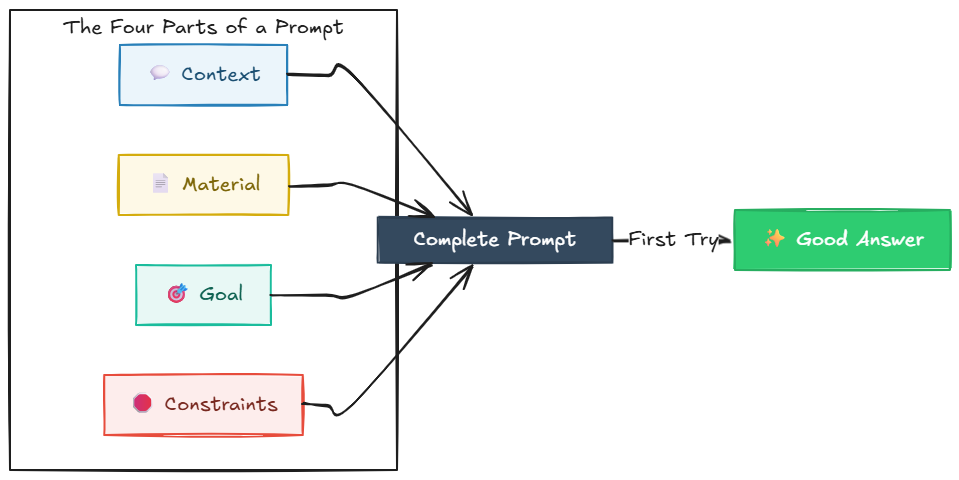

# أساسيات كتابة البرومبت: دليل كلود للمطوّرين

## المقدمة

على الأرجح أنك تستخدم Claude أو Gemini كل يوم. السؤال ليس هل تستخدم الذكاء الاصطناعي — بل هل تحصل على أقصى فائدة منه.

هذا الدليل قصير عن قصد. بدون نظرية، وبدون حشو — فقط العادة الأساسية التي تفصل بين إجابة ذكاء اصطناعي متوسطة وإجابة صحيحة من أول محاولة، مع بعض الأمثلة العملية من عمل المطوّرين الحقيقي. اقرأه خلال أقل من ساعة، وطبّقه في البرومبت التالي.

## الفصل 1: لماذا يكتب معظم المطوّرين برومبتات سيئة للذكاء الاصطناعي

تفتح Claude أو Gemini، تكتب سؤالًا سريعًا، تحصل على إجابة متوسطة، تكتب متابعة، تحصل على إجابة أفضل قليلًا، ثم متابعة أخرى... يبدو مألوفًا؟

هكذا يستخدم معظم المطوّرين الذكاء الاصطناعي — وهذا هو السبب الرئيسي الذي يجعل النتائج تبدو hit-or-miss. ليس لأن الذكاء الاصطناعي غير موثوق، بل لأن **أول برومبت لم يقدّم له ما يكفي ليعمل عليه.**

أن تطلب من الذكاء الاصطناعي إصلاح كودك دون سياق يشبه الاتصال بميكانيكي وتقول: "سيارتي تصدر صوتًا، أصلحها" — ثم تغلق الهاتف قبل أن يسألك: أي سيارة؟ أي صوت؟ ومتى يحدث؟ قد يخمّن بشكل صحيح. غالبًا لن يفعل.

**برومبت سيئ:**

> "هذه الدالة ترجع نتيجة خاطئة. هل يمكنك إصلاحها؟"
> 

> "This function is returning the wrong result. Can you fix it?"
> 

ماذا يحدث بعدها؟ يسأل الذكاء الاصطناعي ماذا تفعل الدالة. تشرح. يسأل عن الكود. تلصقه. يسأل ماذا يعني "wrong". بعد خمس رسائل، أخيرًا تحصل على إجابة مفيدة — وقد صرفت خمسة أضعاف الجهد الذي كان يجب أن يستغرقه الأمر.

**برومبت أفضل:**

> "هذه الدالة يجب أن ترجع أعلى قيمة في قائمة، لكنها ترجع أول قيمة بدلًا من ذلك. هذا هو الكود: [الصق]. ما الخطأ، وكيف أصلحه؟"
> 

> "This function should return the highest value in a list, but it's returning the first value instead. Here's the code: [paste]. What's wrong, and how do I fix it?"
> 

نفس السؤال، ونفس الأداة — لكن النسخة الثانية تعطي إجابة صحيحة من أول محاولة، لأنها قدّمت كل شيء من البداية: السلوك المتوقع، والسلوك الفعلي، والكود نفسه.

**النمط:**

البرومبت السيئ يجعل الذكاء الاصطناعي *يخمّن* ما تريد. البرومبت الجيد يخبره *بالضبط* بما لديك وما تريده.

**قبل أن تضغط إرسال، تحقّق:**

- [ ]  هل أدرجت الكود/الخطأ الحقيقي، وليس مجرد وصف له؟
- [ ]  هل قلتُ ما الذي يعنيه "النجاح"؟
- [ ]  هل يمكن للذكاء الاصطناعي الإجابة دون سؤال متابعة؟

إذا كانت الإجابة على #3 هي "no" — فالبرومبت ليس جاهزًا بعد.

---

## الفصل 2: تشريح البرومبت الجيد

كل برومبت فعّال مبني من أربعة أجزاء. إذا فقدت واحدًا، ستحصل على إجابة ضبابية.

**1. السياق Context** — ما هو هذا الكود/الوضع؟ الذكاء الاصطناعي لا يعرف مشروعك إلا إذا أخبرته.

**2. المادة Material** — الكود أو الخطأ الحقيقي، منسوخًا كما هو. لا تَصِفه.

**3. الهدف Goal** — كيف يبدو "done"؟ "Fix this" غامض. "Return X instead of throwing Y" ليس غامضًا.

**4. القيود Constraints** — ما الذي يجب أن يبقى كما هو؟ conventions، libraries، أشياء لا يجب لمسها.

فكّر بها مثل طلب الطعام عبر إعطاء شخص كيس مشتريات وتقول: "make something good" — مقابل أن تقول: *"I have rice and vegetables (material), I'd like something Asian-style (context), light but filling (goal), and no peanuts — my guest is allergic (constraint)."* نفس المطبخ، نفس المكونات — نتيجة مختلفة تمامًا.

**تجميعها معًا:**

**برومبت ضعيف:**

> "هل يمكنك تحسين هذه الدالة؟"
> 

> "Can you improve this function?"
> 

**برومبت قوي:**

> "هذه الدالة تعالج قائمة طلبات وتحسب الإجماليات. [الصق الكود]. حاليًا تقوم بعمل loop على القائمة ثلاث مرات — مرة لكل عملية حساب. أريد أن تفعل ذلك في مرور واحد لتحسين الأداء. لا تغيّر function signature لأن كودًا آخر يعتمد عليها. ما أفضل طريقة لإعادة هيكلتها؟"
> 

> "This function processes a list of orders and calculates totals. [paste code]. It currently loops through the list three times — once per calculation. I want it to do this in a single pass for performance. Don't change the function signature, other code depends on it. What's the best way to restructure this?"
> 

ما الذي تغيّر:

- **السياق Context**: ماذا تفعل الدالة
- **المادة Material**: الكود الفعلي
- **الهدف Goal**: مرور واحد بدل ثلاثة loops
- **القيود Constraints**: إبقاء function signature كما هو

هذه أربع جمل — ربما 60 ثانية إضافية للكتابة — لكنها الفرق بين حل صحيح وقابل للاستخدام فورًا، وبين ثلاث جولات من الأخذ والرد.

**قالب قابل لإعادة الاستخدام:**

> "أنا أعمل على [السياق]. هذا هو الكود/الخطأ المعني: [الصق]. أريد [هدف محدد]. من فضلك أبقِ [قيد] دون تغيير."
> 

> "I'm working on [context]. Here's the relevant code/error: [paste]. I want [specific goal]. Please keep [constraint] unchanged."
> 

هذا ليس قالبًا صارمًا — بل checklist. طالما الأجزاء الأربعة موجودة، الصياغة لا تهم كثيرًا.

**شيء إضافي:** الذكاء الاصطناعي لا يهتم بالنبرة، بل يهتم بالمعلومات. "Please fix this, thanks so much!" بدون سياق أسوأ من طلب مباشر ومكتمل بلا أي مجاملة. اصرف جهدك على الوضوح، لا على المجاملة.

### **نصيحة: دع أداة مجانية تُحسّن برومبتك أولًا**

إذا لم تكن واثقًا أن برومبتك يغطي الأجزاء الأربعة، استخدم أداة مجانية مثل Gemini أو GitHub Copilot Chat كمحرّر سريع. الصق مسودتك مع قاعدة الأجزاء الأربعة من هذا الفصل، واطلب منه إعادة كتابة برومبتك ليشمل أي شيء ناقص. مثال: *"Here are four things a good prompt needs: context, the actual material, a clear goal, and constraints. Rewrite my prompt below to include all four: [your rough prompt]."* هذا لا يكلّفك شيئًا ويستغرق 10 ثوانٍ — والبرومبت المصقول هو ما ترسله فعليًا إلى Claude.

---

### تقنية إضافية: دع الذكاء الاصطناعي يجري مقابلة معك

للمهام الغامضة أو المفتوحة — التخطيط، المعمارية، أو "I’m not sure what I need yet" — أضف هذا إلى برومبتك:

> "قبل أن تجيب، اسألني أي أسئلة توضيحية تحتاجها لتقديم إجابة مفيدة."
> 

> "Before you answer, ask me any clarifying questions you need to give a useful response."
> 

هذا يعكس المسؤولية: بدل أن تضع كل شيء من البداية، يخبرك الذكاء الاصطناعي ما الذي ينقص. استخدمه عندما فعلًا لا تعرف ما تحتاجه بعد. وتجنّبه في المهام المحددة — لأن الذهاب والإياب هناك يستهلك الاستخدام بلا فائدة.

---

## الفصل 3: برومبتات لمهام تطوير محددة

المهام المختلفة تحتاج أشكال برومبت مختلفة. هنا ثلاثة من الأكثر شيوعًا.

**1. تصحيح الأخطاء Debugging**

خطأ شائع: لصق الخطأ وحده ثم سؤال "why?"

الحل: الخطأ + الكود المرتبط + ما الذي كنت تتوقعه.

> "يظهر لدي `IndexOutOfRangeException` على السطر 12 عندما تكون قائمة الإدخال فارغة. هذه هي الدالة: [الصق]. كنت أتوقع أن ترجع نتيجة فارغة بدلًا من أن تتعطل. ما السبب والإصلاح؟"
> 

> "I'm getting `IndexOutOfRangeException` on line 12 when the input list is empty. Here's the function: [paste]. I expected it to return an empty result instead of crashing. What's the cause and the fix?"
> 

**2. مراجعة الكود / إعادة هيكلته Code review / refactoring**

خطأ شائع: "review this code" — واسع جدًا، وستحصل على ملاحظات عامة.

الحل: قل ما الذي تُحسّنه بالضبط.

> "راجع هذا class من أجل: (1) منطق مكرر عبر methods، (2) أي شيء يجب أن يصبح دالة مستقلة، (3) نقص التحقق من المدخلات. لا تقترح إعادة تسمية — التسمية ثابتة في المشروع. [الصق الكود]"
> 

> "Review this class for: (1) duplicated logic across methods, (2) anything that should be its own function, (3) missing input validation. Don't suggest renaming — naming is fixed across the project. [paste code]"
> 

**3. نقاشات التصميم والمعمارية Architecture & design discussions**

هنا يكون الذكاء الاصطناعي الأكثر فائدة — والأقل استخدامًا. بدل طلب كود، اطلب محادثة.

> "أنا محتار بين تخزين هذا كجدول واحد مع عمود type، أو تقسيمه إلى جداول منفصلة. هذه هي البنية الحالية: [الصق]. ما المفاضلات given [قيودك]؟ لست أطلب كودًا بعد — أريد التفكير في القرار أولًا."
> 

> "I'm deciding between storing this as a single table with a type column, or splitting it into separate tables. Here's the current structure: [paste]. What are the tradeoffs given [your constraints]? I'm not asking for code yet — I want to think through the decision first."
> 

هذه الجملة الأخيرة — "I'm not asking for code yet" — تنقل الذكاء الاصطناعي من وضع "generate output" إلى وضع "think with me"، وهذا ينتج نقاشات معمارية أفضل بكثير.

*هل تريد برومبتات لكتابة الاختبارات والكود القديم أيضًا، بالإضافة إلى AI coding agents وإدارة التكلفة؟ هذا موجود في الدليل المتقدم.*

---

## الفصل 4: أخطاء شائعة وإصلاحات سريعة

| الخطأ | الإصلاح السريع |
| --- | --- |
| "Why doesn't this work?" بدون إرفاق كود أو خطأ | ألصق دائمًا الكود والخطأ الحقيقي — ولا تكتفِ بوصفهما |
| المتابعة رسالة بعد رسالة | اجمع كل شيء في برومبت واحد قبل الإرسال |
| طلب كود عندما تحتاج قرارًا | قل: "don't write code yet — let's think this through" |
| أهداف غامضة ("make this better") | حدد بشكل واضح كيف يبدو "done" |
| نفس المحادثة لمواضيع غير مرتبطة | موضوع جديد = محادثة جديدة |

**العادة الواحدة التي تصلح معظم هذه الأخطاء:**

قبل إرسال أي برومبت، توقّف 10 ثوانٍ واسأل: *"If a new developer joined this project with zero context, would this message alone be enough for them to help?"* إذا لا، فأنت تفتقد Context — وكذلك الذكاء الاصطناعي.

---

## الخلاصة

إذا كان هناك فكرة واحدة تحملها من هذا الدليل: **الذكاء الاصطناعي لا يكافئ الذكاء أو الحيل — بل يكافئ الوضوح.** المطوّرون الذين يحصلون على أكبر فائدة من Claude وGemini لا يكتبون تعاويذ سحرية. هم يصفون وضعهم كاملًا من المرة الأولى.

السياق Context, المادة Material, الهدف Goal, القيود Constraints. من البداية، لا بالتقطير.

ابدأ بشكل بسيط. اختر عادة واحدة — مثل front-loading للبرومبتات، أو مجرد التوقف قبل "why doesn't this work?" للصق الخطأ الحقيقي. طبّقها أسبوعًا. على الأغلب ستلاحظ عددًا أقل من رسائل المتابعة وإجابات أولى أفضل.

*هل تريد النظام الكامل — AI coding agents، وإدارة الاستخدام/التكلفة للفرق، وكل أنواع المهام الخمسة، وقالب البرومبت الكامل؟ راجع الدليل المتقدم.*